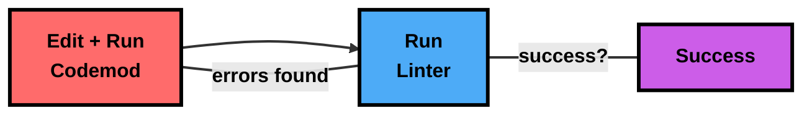

Coding assistants like Cursor have introduced a new era of programming. But there's a class of programming tasks they can't handle: large-scale, systematic modifications across large codebases. You wouldn't ask an AI to delete all dead code or reorganize your entire component hierarchy - the tooling just isn't there.

That's where codemods come in. A codemod is a program that operates on your codebase, and when you give an AI agent the ability to write and execute them, these tasks fall below the high-water mark of AI capabilities.

Here's a real example: we asked [Devin](https://docs.devin.ai/get-started/devin-intro) (an autonomous SWE agent) to "delete all dead code" from our codebase. Instead of trying to make hundreds of individual edits, Devin [wrote and debugged a program](https://github.com/codegen-sh/codegen/pull/660/files#diff-199b0c459adf1639f664fed248fa48bb640412aeacbe61cd89475d6598284b5f) that systematically removed unused code while handling edge cases like tests, decorators and indirect references.

- [View the PR](https://github.com/codegen-sh/codegen/pull/660)
- [View on Devin](app.devin.ai/sessions/a49eac87da644fa9ac1144fe130b847e)

<Frame caption="Devin edits a codemod in response to linter errors">
    
</Frame>

This modifies over 40 files and correctly removes old code, passes lint + tests, etc.

What made this work?

Devin operates like a state machine: write a codemod, run it through the linter, analyze failures, and refine. Each iteration adds handling for new edge cases until the codemod successfully transforms the entire codebase. This is the same cycle developers use for many large-scale refactors, just automated.



The nice part about this approach is that we don't have to blindly trust the AI. There's no magic - it's just a program we can run and verify through linter/test output. The codemod is easy to review, and we can update it if we need to add exceptions or edge cases. Much better than trying to manually review hundreds of individual edits.

## Try it yourself

Want to experience this with your own Devin instance? Install the Codegen CLI in your Devin box:

```bash
uv tool install codegen --python 3.13
```

Then use the following prompt:

<Card title="Dead Code Deletion Prompt" icon="download" href={"https://gist.github.com/jayhack/d742b701a38a5b5274517afce2d253c2"}>
  Download System Prompt
</Card>

Or try it with other platform-level modifications supported by Codegen:

<CardGroup cols={2}>
  <Card
    title="Convert Promises"
    icon="code-merge"
    href="/tutorials/promise-to-async-await"
  >
    Automatically convert Promise chains to async/await syntax across your codebase.
  </Card>
  <Card
    title="Organize Code"
    icon="folder-tree"
    href="/tutorials/organize-your-codebase"
  >
    Move and organize code safely with automatic import and dependency handling.
  </Card>
  <Card
    title="Modernize React"
    icon="react"
    iconType="brands"
    href="/tutorials/react-modernization"
  >
    Convert class components to hooks, standardize props, and organize components.
  </Card>
  <Card
    title="Migrate Tests"
    icon="vial"
    href="/tutorials/unittest-to-pytest"
  >
    Automatically convert unittest test suites to modern pytest style.
  </Card>
</CardGroup>

We'd love to hear how it works for you! Let us know in our [community](https://community.codegen.com) and share other tasks that it is helpful in performing.