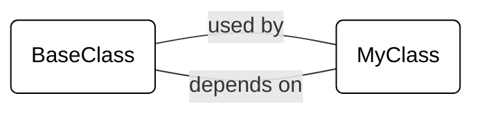

Codegen pre-computes dependencies and usages for all symbols in the codebase, enabling constant-time queries for these relationships.

This document explains how to use the dependency and usage tracking APIs in Codegen.

## Overview

Codegen provides two main ways to track relationships between symbols:

- [`.dependencies`](/api-reference/core/Symbol#dependencies) / [`.get_dependencies(...)`](/api-reference/core/Symbol#get-dependencies) - What symbols does this symbol depend on?
- [`.usages`](/api-reference/core/Symbol#usages) / [`.usages(...)`](/api-reference/core/Symbol#usages) - Where is this symbol used?

Dependencies and usages are inverses of each other. For example, given the following input code:

```python
# Input code
from module import BaseClass

class MyClass(BaseClass):
    pass
```

The following assertions will hold in the Codegen API:

```python
base = codebase.get_symbol("BaseClass")
my_class = codebase.get_symbol("MyClass")

# MyClass depends on BaseClass
assert base in my_class.dependencies

# BaseClass is used by MyClass
assert my_class in base.usages
```

If `A` depends on `B`, then `B` is used by `A`. This relationship is tracked in both directions, allowing you to navigate the codebase from either perspective.



- `MyClass.dependencies` answers the question: *"which symbols in the codebase does MyClass depend on?"*

- `BaseClass.usages` answers the question: *"which symbols in the codebase use BaseClass?"*

## Usage Types

Both APIs use the [UsageType](../api-reference/core/UsageType) enum to specify different kinds of relationships:

```python
class UsageType(IntFlag):
    DIRECT = auto()    # Direct usage within the same file
    CHAINED = auto()   # Usage through attribute access (module.symbol)
    INDIRECT = auto()  # Usage through a non-aliased import
    ALIASED = auto()   # Usage through an aliased import
```

### DIRECT Usage

A direct usage occurs when a symbol is used in the same file where it's defined, without going through any imports or attribute access.

```python
# Define MyClass
class MyClass:
    def __init__(self):
        pass

# Direct usage of MyClass in same file
class Child(MyClass):
    pass
```

### CHAINED Usage

A chained usage occurs when a symbol is accessed through module or object attribute access, using dot notation.

```python
import module

# Chained usage of ClassB through module
obj = module.ClassB()
# Chained usage of method through obj
result = obj.method()
```

### INDIRECT Usage

An indirect usage happens when a symbol is used through a non-aliased import statement.

```python
from module import BaseClass

# Indirect usage of BaseClass through import
class MyClass(BaseClass):
  pass
```

### ALIASED Usage

An aliased usage occurs when a symbol is used through an import with an alias.

```python
from module import BaseClass as AliasedBase

# Aliased usage of BaseClass
class MyClass(AliasedBase):
  pass
```

## Dependencies API

The dependencies API lets you find what symbols a given symbol depends on.

### Basic Usage

```python
# Get all direct dependencies
deps = my_class.dependencies  # Shorthand for get_dependencies(UsageType.DIRECT)

# Get dependencies of specific types
direct_deps = my_class.get_dependencies(UsageType.DIRECT)
chained_deps = my_class.get_dependencies(UsageType.CHAINED)
indirect_deps = my_class.get_dependencies(UsageType.INDIRECT)
```

### Combining Usage Types

You can combine usage types using the bitwise OR operator:

```python
# Get both direct and indirect dependencies
deps = my_class.get_dependencies(UsageType.DIRECT | UsageType.INDIRECT)

# Get all types of dependencies
deps = my_class.get_dependencies(
    UsageType.DIRECT | UsageType.CHAINED |
    UsageType.INDIRECT | UsageType.ALIASED
)
```

### Common Patterns

1. Finding dead code (symbols with no usages):

```python
# Check if a symbol is unused
def is_dead_code(symbol):
    return not symbol.usages

# Find all unused functions in a file
dead_functions = [f for f in file.functions if not f.usages]
```

<Tip>
  See [Deleting Dead Code](/tutorials/deleting-dead-code) to learn more about finding
  unused code.
</Tip>

2. Finding all imports that a symbol uses:

```python
# Get all imports a class depends on
class_imports = [dep for dep in my_class.dependencies if isinstance(dep, Import)]

# Get all imports used by a function, including indirect ones
all_function_imports = [
    dep for dep in my_function.get_dependencies(UsageType.DIRECT | UsageType.INDIRECT)
    if isinstance(dep, Import)
]
```
